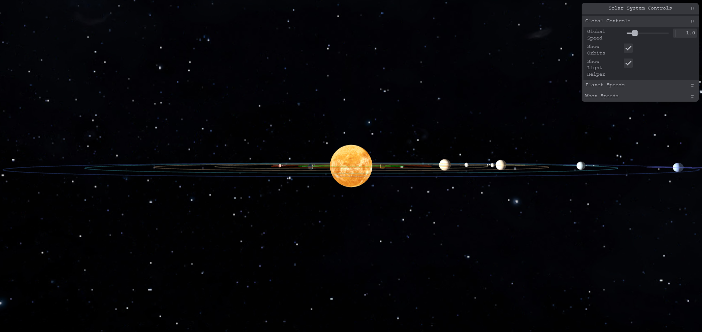

````markdown
# 🌌 3D Solar System with Three.js

A visually immersive 3D Solar System simulation built using [Three.js](https://threejs.org/). Navigate through space, observe planetary orbits, and explore our solar system in real-time 3D right in your browser!

---

## 🚀 Features

- Realistic 3D rendering of the Sun and planets
- Orbital movement and rotation simulation
- Interactive camera controls
- Built with Three.js and modern JavaScript tooling

---

## 📦 Getting Started

Follow the steps below to run the project locally.

### 1. Clone the repository

```bash
git clone https://github.com/your-username/3d-solar-system.git
```

### 2. Navigate into the Solar_System folder

```bash
cd Solar_System_3D
```

### 3. Install the dependencies

```bash
npm install
```

### 4. Start the development server

```bash
npm run dev
```

> The app should now be running on `http://localhost:5173`.

---

## 🛠 Technologies Used

* [Three.js](https://threejs.org/)
* [Vite](https://vitejs.dev/) (for fast builds and hot reloads)
* JavaScript (ES6+)
* HTML / CSS

---


## 🌍 Preview


*A glimpse of the 3D Solar System in action.*

---

## 🙌 Contributions

Contributions, suggestions, and improvements are welcome! Feel free to fork the project and open a pull request.

---

## ✨ Author

Developed with ❤️ by **Soudip Mondal**

```